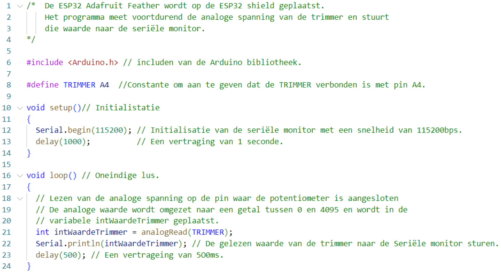

---
mathjax:
  presets: '\def\lr#1#2#3{\left#1#2\right#3}'
---

# De ESP32 Extension shield

Om het programmeren wat eenvoudiger te maken gaan we gebruik maken van een ESP32 shield.


De shield heeft 4 drukknoppen, 8 leds, een trimmer en een connector om SPI- en I2C componenten aan te sluiten. In de volgende tabel is weergegeven wat de naam en op welke IO-pin deze zijn aangesloten. De connector met de SPI en I²C aansluitingen zijn niet weergegeven maar deze kan een goede technicus uit het schema van de volgende figuur halen.


| Naam | IO-pin |
| ----------- |:------------:|
| SW1| 39 | 
| SW2| 34| 
| SW3| 25 | 
| SW4| 26 | 
| LED1| 21 | 
| LED2| 14 | 
| LED3| 32 | 
| LED4| 15 | 
| LED5| 33 | 
| LED6| 27 | 
| LED7| 12 | 
| LED8| 13 | 
| POT| A4 | 


## Voorbeeldprogramma analoge ingang



## Testen van de ESP32 shield voor de Adafruit Huzzah32 feather

Onderstaande code kan men gebruiken om de shield te testen.

```cpp
#include <Arduino.h>
#define led1 21
#define led2 14
#define led3 32
#define led4 15
#define led5 33
#define led6 27
#define led7 12
#define led8 13
#define sw1 39
#define sw2 34
#define sw3 25
#define sw4 26
#define potentiometer 36
int potWaarde = 0;
void setup() {
  // put your setup code here, to run once:
  Serial.begin(115200); // open the serial port at 115200 bps:
  pinMode(led1, OUTPUT);
  pinMode(led2, OUTPUT);
  pinMode(led3, OUTPUT);
  pinMode(led4, OUTPUT);
  pinMode(led5, OUTPUT);
  pinMode(led6, OUTPUT);
  pinMode(led7, OUTPUT);
  pinMode(led8, OUTPUT);
  pinMode(sw1, INPUT);
  pinMode(sw2, INPUT);
  pinMode(sw3, INPUT);
  pinMode(sw4, INPUT);
}
void loop() {
  // put your main code here, to run repeatedly:
  digitalWrite(led1, !digitalRead(sw1));
  digitalWrite(led2, !digitalRead(sw2));
  digitalWrite(led3, !digitalRead(sw3));
  digitalWrite(led4, !digitalRead(sw4));
  digitalWrite(led5, digitalRead(sw1));
  digitalWrite(led6, digitalRead(sw2));
  digitalWrite(led7, digitalRead(sw3));
  digitalWrite(led8, digitalRead(sw4));

  potWaarde = analogRead(potentiometer);
  Serial.print("De potentiometer waarde = ");
  Serial.println(potWaarde, DEC);
}
```

<div style="background-color:darkgreen; text-align:left; vertical-align:left; padding:15px;">
<p style="color:lightgreen; margin:10px">
Opdracht: Maak een programma waarbij de spanning op de analoge ingang A2 wordt gelezen en doorgestuurd wordt naar een seriële monitor op de PC.<br>
Sluit een potentiometer aan op de analoge ingang A2 via een breadbord.
</p>
</div>

***

<html>
<div style="background-color:darkgreen; text-align:left; vertical-align:left; padding:15px;">
<p style="color:lightgreen; margin:10px">
Opdracht: Maak een programma waarbij de spanning op de analoge ingang A4 (is dit hetzelfde als pin36?, zoek dit op) wordt gelezen en 4 leds stuurt afhankelijk van de gemeten waarde volgens onderstaande tabel<br>
Maak gebruik van de ESP32-shield.
</p>
<table>
  <tr bgcolor="Gray">
    <th>waarde A4</th>
    <th>LED1</th>
    <th>LED2</th>
    <th>LED3</th>
    <th>LED4</th>
  </tr>
  <tr bgcolor="DimGray">
    <td>X&lt=819 (&lt=20%)</td>
    <td>0</td>
    <td>0</td>
    <td>0</td>
    <td>0</td>
  </tr>
  <tr bgcolor="Gray">
    <td>819 &lt X &lt= 1638 <br> 20% &lt X &lt= 40%</td>
    <td>1</td>
    <td>0</td>
    <td>0</td>
    <td>0</td>
  </tr>
  <tr bgcolor="DimGray">
    <td>1638 &lt X &lt= 2457 <br> 40% &lt X &lt= 60%</td>
    <td>1</td>
    <td>1</td>
    <td>0</td>
    <td>0</td>
  </tr>
  <tr bgcolor="Gray">
    <td>2457 &lt X &lt= 3276 <br> 60% &lt X &lt= 80%</td>
    <td>1</td>
    <td>1</td>
    <td>1</td>
    <td>0</td>
  </tr>
  <tr bgcolor="DimGray">
    <td>3276 &lt X &lt= 4095 <br> 80% &lt X &lt= 100%</td>
    <td>1</td>
    <td>1</td>
    <td>1</td>
    <td>1</td>
  </tr>
</table>
</div>
</html>

***

::: tip
Bij bepaalde opdrachten kan het interessant zijn dat een unsigned integer 0-255 (een char type dus) moet omgezet worden naar 8bits. Ziehier een methode die dit voor u kan doen.
:::

```cpp
void ToonLEDS (unsigned char data)
{           
if (data/128%2 != 0)            { digitalWrite(led8, HIGH); }        //Set   LED8   
else    { digitalWrite(led8, LOW);}        //Reset LED8   
if (data/64%2 != 0)            { digitalWrite(led7, HIGH); }         //Set   LED7   
else    { digitalWrite(led7, LOW);}     //Reset LED7   
if (data/32%2 != 0)            { digitalWrite(led6, HIGH);}           //Set   LED6   
else    { digitalWrite(led6, LOW);}      //Reset LED6   
if (data/16%2 != 0)            { digitalWrite(led5, HIGH);}         //Set   LED5   
else    { digitalWrite(led5, LOW);}     //Reset LED5   
if (data/8%2 != 0)            { digitalWrite(led4, HIGH);}           //Set   LED4   
else    { digitalWrite(led4, LOW);}      //Reset LED4   
if (data/4%2 != 0)            { digitalWrite(led3, HIGH);}           //Set   LED3   
else    { digitalWrite(led3, LOW);}      //Reset LED3   
if (data/2%2 != 0)            { digitalWrite(led2, HIGH);}           //Set   LED2   
else    { digitalWrite(led2, LOW);}      //Reset LED2   
if (data%2 != 0)            { digitalWrite(led1, HIGH);}           //Set   LED1   
else    { digitalWrite(led1, LOW);}      //Reset LED1
}
```

<div style="background-color:darkgreen; text-align:left; vertical-align:left; padding:15px;">
<p style="color:lightgreen; margin:10px">
Opdracht: Zorg dat je met voorgaande methode een analoge ingang inleest, en dat die waarde binair wordt weergegeven op de 8 LEDS.
</p>
</div>

***

<div style="background-color:darkgreen; text-align:left; vertical-align:left; padding:15px;">
<p style="color:lightgreen; margin:10px">
Opdracht: Oef1 : Knipperen van een LED vlug - traag op basis van toestand van een digitale input.
</p>
</div>

***

<div style="background-color:darkgreen; text-align:left; vertical-align:left; padding:15px;">
<p style="color:lightgreen; margin:10px">
Opdracht: Oef2 : Laat een LED bij de start 10 keer snel knipperen en daarna oneindig keer op een lage snelheid knipperen
</p>
</div>

***

<div style="background-color:darkgreen; text-align:left; vertical-align:left; padding:15px;">
<p style="color:lightgreen; margin:10px">
Opdracht: Oef3 : Laat een LED knipperen met een oplopende snelheid (repetitief). Als dit werkt, bij max snelheid terug aflopende snelheid en dit ook repetitief. 
</p>
</div>

***

<div style="background-color:darkgreen; text-align:left; vertical-align:left; padding:15px;">
<p style="color:lightgreen; margin:10px">
Opdracht: Oef4 : Wat is de minimum delay tijd bij het knipperen van een LED zodat we het net niet meer kunnen waarnemen. Wat is dan de knipperfrequentie en wat is de knipperperiode? Meet met de oscilloscoop. Bereken en bepaal het verband met uw delay tijden. 
</p>
</div>

***

<div style="background-color:darkgreen; text-align:left; vertical-align:left; padding:15px;">
<p style="color:lightgreen; margin:10px">
Opdracht: Oef5 : Wijzig bij het onzichtbaar knipperen (door de hoge knipperfrequentie) de AAN-tijd tot 10% van de knipperperiode. Wat is dit in seconden? wat is dan de UIT-tijd in seconden? Let wel de knipperfrequentie mag niet wijzigen. Meet met de oscilloscoop. Bereken en bepaal het verband met uw delay tijden. 
</p>
</div>

***